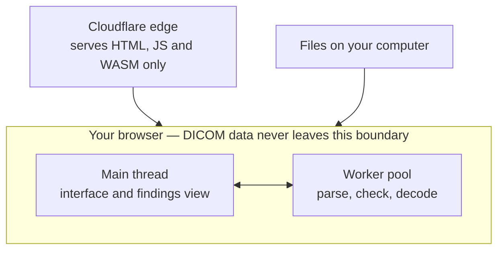
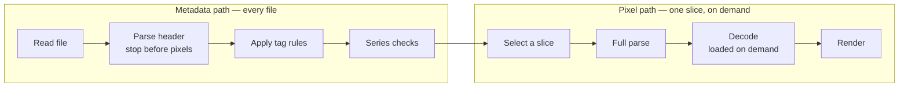
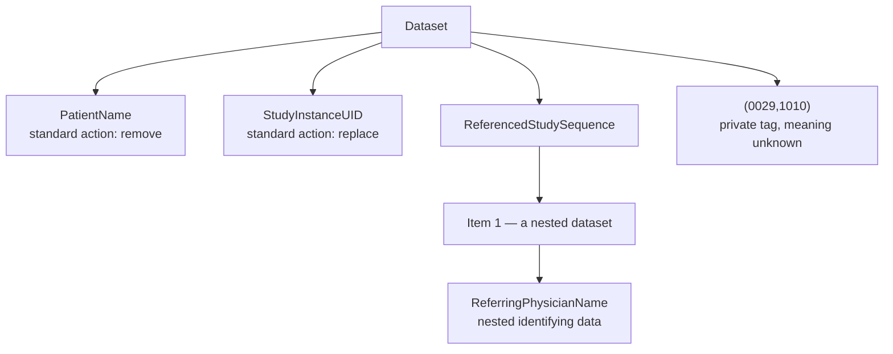

# ScanLint

**Find identifying information hidden in medical image files — without ever uploading them.**

ScanLint is a browser-based inspector for DICOM medical imaging files. It reads the metadata inside a scan, shows you what's there, and flags every field that could identify a patient.

> **Your files never leave your computer.** All reading and analysis happens inside your browser. Nothing is uploaded, transmitted, logged or stored anywhere. You can disconnect from the internet after the page loads and ScanLint will keep working.

**Status:** Stage 1 in development. Live at [scanlint.raihanvaheed.dev](https://scanlint.raihanvaheed.dev) once released.

---

## What is this, in plain language?

### Medical images carry more than pictures

When a hospital takes an MRI, CT scan or X-ray, the result is saved as a **DICOM** file — the universal standard format for medical imaging, used by virtually every scanner and hospital system in the world.

A DICOM file isn't just an image. It's an image wrapped in a large block of **metadata**: hundreds of labelled fields describing the scan. Some are technical — the scanner model, the slice thickness, the magnetic field strength. But many are personal: the patient's name, date of birth, medical record number, the referring doctor, the hospital, the date and time of the visit.

### Why that's a problem

Scans are constantly shared beyond the hospital that made them — with researchers, with AI developers training models, with second-opinion specialists, in teaching materials and published papers. Before that happens, the identifying information has to be removed. This is called **de-identification**.

It's easy to get wrong. The obvious fields like patient name get cleared, but identifying details hide in less obvious places:

- **Nested inside other fields.** DICOM metadata isn't a flat list. Some fields contain whole groups of further fields, several levels deep. A referring doctor's name can sit three levels down, invisible to anything that only checks the top level.
- **In manufacturer-specific fields.** Scanner vendors are allowed to add their own custom fields, called **private tags**. Their contents aren't defined by any standard, so nobody outside that manufacturer can be sure what's in them.
- **Burned into the image itself.** Some scanners print the patient's name directly onto the pixels. No amount of metadata cleaning removes that.

### What ScanLint does about it

ScanLint opens a DICOM file, reads every field at every depth, and checks each one against the DICOM standard's own published list of identifying fields. It then shows you, clearly, what it found and where.

It's a **linter for medical scans** — the same idea as a code linter that flags problems before you ship, applied to imaging data before you share it.

---

## Who it's for

- **Researchers** checking a dataset before sharing it with collaborators
- **Engineers** building imaging pipelines who need to see what's actually inside their files
- **Students and educators** learning how DICOM metadata is structured
- **Anyone curious** about what a medical scan file actually contains

---

## How to use it

1. **Open ScanLint** in any modern browser. There's nothing to install and no account to create.
2. **Load a file.** Drag a `.dcm` file onto the page, or click **Load sample** to try it with a synthetic example scan.
3. **Read the summary.** ScanLint shows how many fields it found, and how many could identify a patient.
4. **Browse the metadata tree.** Every field in the file, organised the way DICOM nests them. Expand any group to look inside.
5. **Review the findings.** Each flagged field shows where it sits in the file, why it was flagged, and what the DICOM standard says should be done with it.

The sample scan is entirely synthetic — generated for this project, with made-up identifying details planted deliberately so you can see every kind of finding. It contains no real patient data.

---

## What it checks

**The DICOM confidentiality profile.** The DICOM standard itself publishes a list of every field that may carry identifying information, and specifies what should be done with each — defined in **PS3.15, Annex E**. ScanLint checks every field against that list and reports the prescribed action:

- **Remove** the field entirely
- **Blank** it, keeping the field but emptying its value
- **Replace** it with a dummy value
- **Replace the identifier** with a newly generated one
- **Clean** it, keeping the useful parts and stripping the identifying parts
- **Keep** it, where the standard judges it safe

**Nested fields.** ScanLint walks every level of the metadata, not just the top. Identifying information hidden inside nested groups is found and reported with its exact location.

**Private tags.** Every manufacturer-specific field is listed separately. ScanLint can't know what they contain, so it surfaces them for a human to decide.

**Burned-in annotation warnings.** DICOM has a field declaring whether text has been printed onto the image. ScanLint reports it — with the caveat below.

**Series consistency** *(Stage 2).* A single scan is usually hundreds of files, one per slice. ScanLint will check that they belong together and agree with each other.

---

## What it does not do

This matters, so it's stated plainly.

**ScanLint does not detect text burned into the image pixels.** The field declaring burned-in text is frequently missing or wrong in real files. ScanLint reports what the field says, but a file marked clean can still have a name printed on it. Always look at the image.

**ScanLint is not a certified de-identification tool.** It does not by itself make data compliant with HIPAA, PHIPA, GDPR, or any other privacy regulation. It's an inspection aid — it helps a person see what's there. Regulated de-identification requires a validated process and human review.

**ScanLint is not a medical device** and must not be used for diagnosis or clinical decisions.

**The current version only inspects.** It shows you what's in a file but doesn't modify it. Producing a cleaned copy is planned for a later stage.

---

## How it works

### Everything runs in your browser

The server's only job is to deliver the application code. After the page loads, your files are read directly from your computer by the browser, and the analysis runs locally. There's no server-side processing, because there is no server-side code.



Parsing happens in **Web Workers** — background threads — so that reading hundreds of files never freezes the page.

### Two paths: fast metadata, slow pixels

Image data is by far the largest part of a DICOM file, and it isn't needed to find identifying metadata. So ScanLint reads files in two separate ways.



The **metadata path** reads each file only up to the pixel data, tag `(7FE0,0010)`, which always comes last. For a typical scan slice that means reading a few kilobytes and skipping hundreds, so a whole series can be scanned in seconds.

The **pixel path** runs only when you choose to view a specific slice. Image decoders are large, so they're downloaded only the first time an image is actually requested. Anyone who only needs the metadata never downloads them.

### Walking nested metadata

DICOM metadata is a tree, not a list. Some fields — called **sequences** — contain items, and each item is itself a complete set of fields that can contain further sequences.



ScanLint descends recursively through every sequence, applying the same rules at every depth. Every finding records its full **path** through the tree, so a field that appears at several depths is always reported at the exact location where it occurs.

---

## Roadmap

ScanLint is built in stages. Each stage is released and usable on its own.

**Stage 1 — Single file inspection** *(in development).* Load one file, browse the full metadata tree, flag identifying fields against the confidentiality profile, recurse into sequences, list private tags.

**Stage 2 — Full series.** Load an entire scan of hundreds of files. Group them by study and series, and check them against each other for inconsistent identifiers, mismatched spacing, and missing slices.

**Stage 3 — Image preview.** View individual slices, with support for the compressed image formats scanners commonly use.

**Stage 4 — Anonymiser.** Produce a cleaned copy of a file, applying the confidentiality profile's actions, with identifiers replaced consistently across a whole series so the files still belong together afterwards.

---

## Technology

- **Next.js** and **TypeScript**, built as a fully static site
- **Tailwind CSS**
- **dicom-parser** for reading DICOM files in the browser
- **Web Workers** for background parsing
- **dcmjs** for writing modified files *(Stage 4)*
- **Cloudflare** for static hosting

---

## Running locally

Requires Node.js 22 or later and pnpm.

```bash
pnpm install
pnpm dev
```

Then open `http://localhost:3000`.

To produce a static build:

```bash
pnpm build
```

### Generating test data

The sample scans are created by a script rather than taken from a real dataset, so there's no patient data and no licensing question. The generator deliberately plants each hard case — identifying data nested inside a sequence, a block of private tags, an inconsistent identifier — so every finding type can be tested.

Requires Python 3 with `pydicom` and `numpy`:

```bash
python scripts/make-sample-study.py
```

Output is written to `public/samples/`.

---

## References

- [DICOM PS3.15 Annex E — Attribute Confidentiality Profiles](https://dicom.nema.org/medical/dicom/current/output/html/part15.html#chapter_E) — the standard's own definition of which fields may identify a patient, and what should be done with each
- [DICOM standard](https://www.dicomstandard.org/) — the full specification
- [dicom-parser](https://github.com/cornerstonejs/dicomParser) — the browser DICOM parsing library used here

---

## Licence

MIT.

ScanLint is provided for inspection and educational purposes. It is not a medical device, not a certified de-identification tool, and provides no guarantee of regulatory compliance. See **What it does not do** above.