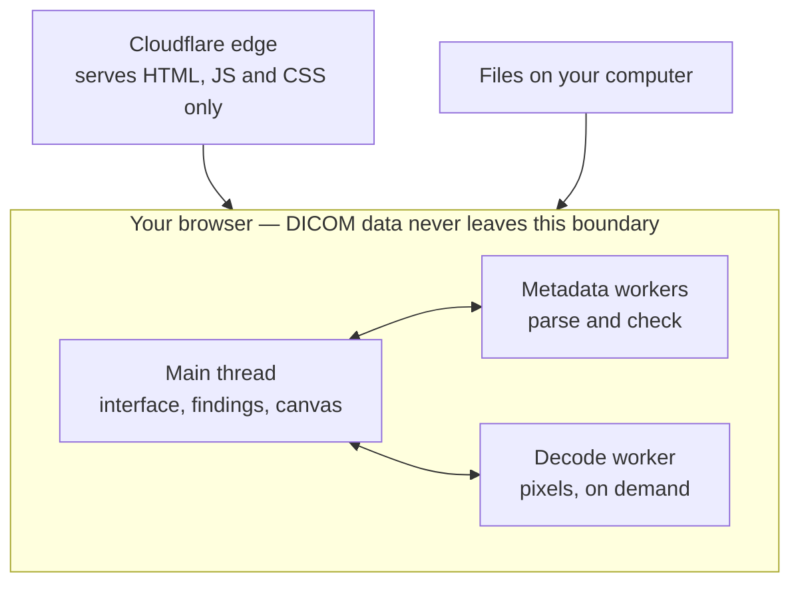
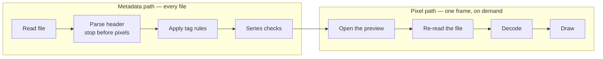
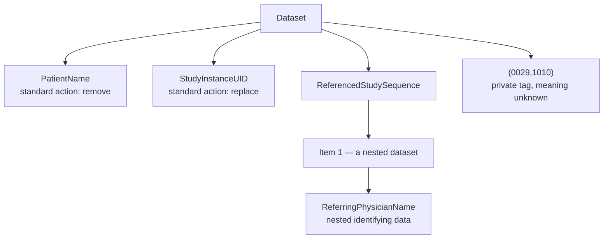

# ScanLint

**Find identifying information hidden in medical image files — without ever uploading them.**

ScanLint is a browser-based inspector for DICOM medical imaging files. It reads the metadata inside a scan, shows you what's there, flags every field that could identify a patient, and lets you look at the pixels to check the one thing metadata cannot tell you.

> **Your files never leave your computer.** All reading and analysis happens inside your browser. Nothing is uploaded, transmitted, logged or stored anywhere. The only network requests ScanLint ever makes are for its own code and its two bundled sample files — never for anything you load. A test in the repository asserts that, by counting every network call in the source and failing if one appears that isn't a request for a bundled sample.

**Status:** Stages 1, 2 and 3 complete. Live at [scanlint.raihanvaheed.dev](https://scanlint.raihanvaheed.dev).

---

## What is this, in plain language?

### Medical images carry more than pictures

When a hospital takes an MRI, CT scan or X-ray, the result is saved as a **DICOM** file — the universal standard format for medical imaging, used by virtually every scanner and hospital system in the world.

A DICOM file isn't just an image. It's an image wrapped in a large block of **metadata**: hundreds of labelled fields describing the scan. Some are technical — the scanner model, the slice thickness, the magnetic field strength. But many are personal: the patient's name, date of birth, medical record number, the referring doctor, the hospital, the date and time of the visit.

### Why that's a problem

Scans are constantly shared beyond the hospital that made them — with researchers, with AI developers training models, with second-opinion specialists, in teaching materials and published papers. Before that happens, the identifying information has to be removed. This is called **de-identification**.

It's easy to get wrong. The obvious fields like patient name get cleared, but identifying details hide in less obvious places:

- **Nested inside other fields.** DICOM metadata isn't a flat list. Some fields contain whole groups of further fields, several levels deep. A referring doctor's name can sit three levels down, invisible to anything that only checks the top level.
- **In manufacturer-specific fields.** Scanner vendors are allowed to add their own custom fields, called **private tags**. Their contents aren't defined by any standard, so nobody outside that manufacturer can be sure what's in them.
- **On one slice out of five hundred.** A study is hundreds of files. A field can be clean in every one of them except the first, which still carries the name it was acquired with.
- **Burned into the image itself.** Some scanners print the patient's name directly onto the pixels. No amount of metadata cleaning removes that, and the field that's supposed to declare it is unreliable.

### What ScanLint does about it

ScanLint opens a DICOM file — or a whole folder of them — reads every field at every depth, and checks each one against the DICOM standard's own published list of identifying fields. It then shows you, clearly, what it found and where.

It's a **linter for medical scans** — the same idea as a code linter that flags problems before you ship, applied to imaging data before you share it.

---

## Who it's for

- **Researchers** checking a dataset before sharing it with collaborators
- **Engineers** building imaging pipelines who need to see what's actually inside their files
- **Students and educators** learning how DICOM metadata is structured
- **Anyone curious** about what a medical scan file actually contains

---

## How to use it

1. **Open ScanLint** in any modern browser. There's nothing to install and no account to create.
2. **Load something.** Drag a `.dcm` file onto the page, drop a whole folder, or use one of the two sample buttons. **Load sample** opens a single synthetic scan. **Load a scan with text in the image** opens one whose metadata declares no burned-in annotation while its pixels spell out a patient's name.
3. **Read the summary.** How many fields were found, and how many could identify a patient. For a folder: how many files, how they group into studies and series, and which ones disagree with the rest.
4. **Review the findings.** Each flagged field shows where it sits in the file, why it was flagged, and what the DICOM standard says should be done with it. Values are masked by default — reveal them one row at a time, or all at once.
5. **Browse the metadata tree.** Every field in the file, organised the way DICOM nests them. Clicking a finding expands the tree to that exact path.
6. **Look at the image.** Open the preview to see the pixels. Drag or use the arrow keys to adjust window and level, step through a series in its true geometric order, and step through the frames of a multi-frame file.
7. **Export the answer** as a report. Field values are excluded unless you ask for them.

The sample files are synthetic, generated for this project with invented patient details. They contain no real patient data.

---

## What it checks

**The DICOM confidentiality profile.** The standard itself publishes a list of every field that may carry identifying information, and specifies what should be done with each — defined in **PS3.15, Annex E**. ScanLint checks every field against that list and reports the prescribed action:

- **Remove** the field entirely
- **Blank** it, keeping the field but emptying its value
- **Replace** it with a dummy value
- **Replace the identifier** with a newly generated one
- **Clean** it, keeping the useful parts and stripping the identifying parts
- **Keep** it, where the standard judges it safe

**Every field, named.** The full data dictionary from **PS3.6** — 5,214 attributes — is extracted from the standard and bundled, so fields are shown by name rather than by tag number, and files written without explicit data types can still be read.

**Nested fields.** ScanLint walks every level of the metadata, not just the top. Identifying information hidden inside nested groups is found and reported with its exact location.

**Private tags.** Every manufacturer-specific field is listed separately. ScanLint can't know what they contain, so it surfaces them for a human to decide.

**Whole studies.** Drop a folder and ScanLint groups it into studies and series, orders the slices by geometry rather than by the number that looks like it means order, and gives one answer for the study. It names every file that differs from the rest — a field present on one slice only, or a value that changes between slices.

**The image itself.** A preview draws the pixels so you can check for burned-in text yourself. Uncompressed, RLE and JPEG baseline images are decoded; window and level are adjustable; multi-frame files show their frame count and let you step through every frame.

**Burned-in annotation warnings.** DICOM has a field declaring whether text has been printed onto the image. ScanLint reports it — with the caveat below, which is the reason the preview exists.

---

## What ScanLint cannot do

ScanLint reads metadata and draws pixels. These are the places where that is not the whole story, stated here rather than discovered later.

**It cannot tell you whether text is printed into the image — only show you.** Some scans have the patient's name burned into the pixels by the scanner or a later tool. ScanLint reports what the file's Burned In Annotation field claims, and that field is unreliable in both directions: files that declare `NO` sometimes have text, and files with text sometimes declare nothing at all. The preview exists so you can judge for yourself, and one of the bundled samples is a file that lies about this on purpose.

**Some compressed images will not display.** ScanLint shows uncompressed, RLE and JPEG baseline images. JPEG 2000, JPEG-LS, lossless JPEG, high-throughput JPEG 2000 and the video transfer syntaxes are named and refused rather than decoded. The metadata is read either way — a file whose image cannot be shown still gets every field, every finding and every consistency check.

This is a choice rather than an omission. Decoding those formats in a browser means shipping megabytes of WebAssembly, downloaded by everyone who only wanted to read field names, and the files it would serve are the ones least likely to need a preview: JPEG 2000 is what hospitals store CT and MR in, and those slices rarely carry burned-in text, because their identifiers live in the metadata ScanLint already reads. The images that *do* carry text — ultrasound frames, secondary captures, scanned requisitions, screenshots of reports — are uncompressed or JPEG baseline, which the browser decodes on its own.

**Private tags are reported, not interpreted.** Odd-numbered groups hold manufacturer-defined data whose meaning is not in any public standard. ScanLint tells you they are there and shows their contents where it can. What is inside them is between you and the vendor's conformance statement. In files written with implicit VR their contents cannot be read at all — the file does not declare the data type, and no dictionary supplies one for a private tag.

**A few data types are ambiguous by design.** Some attributes are defined as `US or SS`, and the standard resolves which from the Pixel Representation field elsewhere in the file. ScanLint reads them as `US`. This affects a small number of attributes and only in files written with implicit VR.

**Window and level are linear only.** Where a file supplies a VOI lookup table instead of a window centre and width, ScanLint ignores the table and computes a linear window. The image is usable; it is not exactly what the file asked for.

**Frames are shown in the order the file declares.** For enhanced multi-frame images the spatial position of each frame lives in the Per-Frame Functional Groups Sequence, which ScanLint does not read. Declared order is almost always acquisition order, but it is not derived from geometry the way slice order within a series is.

**Files containing `OV`, `SV` or `UV` elements will not open.** These value representations were added to DICOM in 2019 and the underlying parser does not handle their length encoding. Such a file fails to load with an error rather than loading incompletely. The Extended Offset Table attribute found in some newer compressed multi-frame images is the likely case.

**Deflated files will not open either.** A dataset written with Deflated Explicit VR Little Endian is compressed as a whole, and the parser rejects it before ScanLint sees any field. Decompressing it would need another dependency for one rare transfer syntax.

**Flagging is not anonymising.** ScanLint tells you what a de-identification profile would act on. It does not change your file, and nothing here is a substitute for a validated anonymisation pipeline or for your institution's review.

**ScanLint is not a certified de-identification tool.** It does not by itself make data compliant with HIPAA, PHIPA, GDPR, or any other privacy regulation. It is an inspection aid — it helps a person see what's there.

**ScanLint is not a medical device** and must not be used for diagnosis or clinical decisions.

---

## How it works

### Everything runs in your browser

The server's only job is to deliver the application code. After the page loads, your files are read directly from your computer by the browser, and the analysis runs locally. There's no server-side processing, because there is no server-side code.


```mermaid
flowchart TB
    edge["Cloudflare edge<br/>serves HTML, JS and CSS only"]
    subgraph browser["Your browser — DICOM data never leaves this boundary"]
        ui["Main thread<br/>interface, findings, canvas"]
        pool["Metadata workers<br/>parse and check"]
        pix["Decode worker<br/>pixels, on demand"]
        ui <--> pool
        ui <--> pix
    end
    disk["Files on your computer"]
    edge --> browser
    disk --> browser
```

Parsing happens in **Web Workers** — background threads — so that reading hundreds of files never freezes the page. Image decoding happens in a second, separate worker, and JPEG baseline images are handed to the browser's own image decoder from an in-memory buffer. No network request is made at any point in that path, which a request log confirms.

### Two paths, kept physically apart

Image data is by far the largest part of a DICOM file, and it isn't needed to find identifying metadata. So ScanLint reads files in two separate ways, in two separate workers whose code cannot reach each other — a test walks the import graph in both directions and fails if it ever does.


```mermaid
flowchart LR
    subgraph meta["Metadata path — every file"]
        direction LR
        a["Read file"] --> b["Parse header<br/>stop before pixels"] --> c["Apply tag rules"] --> d["Series checks"]
    end
    subgraph pix["Pixel path — one frame, on demand"]
        direction LR
        e["Open the preview"] --> f["Re-read the file"] --> g["Decode"] --> h["Draw"]
    end
    d --> e
```

The **metadata path** reads each file only up to the pixel data, tag `(7FE0,0010)`, which always comes last. For a typical scan slice that means reading a few kilobytes and skipping hundreds, so a whole series can be scanned in seconds.

The **pixel path** runs only when you open a preview. The separation is worth it in the direction people don't expect: the metadata worker carries 321 KB of bundled standards tables and loads on the first parse, so putting image code beside it would mean everyone downloading both. The decode worker is 15.7 KB and arrives only when an image is actually requested — small precisely because of the decision not to ship WebAssembly codecs.

Re-reading the file to decode its pixels costs between 0.006 and 0.05 milliseconds even on a 512 KB slice, because the parser records the pixel element's offset and length and seeks past it rather than reading it. So keeping the image bytes out of memory is not a trade-off against speed; it's free.

### Walking nested metadata

DICOM metadata is a tree, not a list. Some fields — called **sequences** — contain items, and each item is itself a complete set of fields that can contain further sequences.


```mermaid
flowchart TD
    ds["Dataset"]
    ds --> pn["PatientName<br/>standard action: remove"]
    ds --> uid["StudyInstanceUID<br/>standard action: replace"]
    ds --> sq["ReferencedStudySequence"]
    sq --> item["Item 1 — a nested dataset"]
    item --> rp["ReferringPhysicianName<br/>nested identifying data"]
    ds --> priv["(0029,1010)<br/>private tag, meaning unknown"]
```

ScanLint descends recursively through every sequence, applying the same rules at every depth. Every finding records its full **path** through the tree, so a field that appears at several depths is always reported at the exact location where it occurs.

### Ordering slices

Slices are ordered by **geometry**, not by `InstanceNumber`. The instance number is right often enough to pass a demo and wrong whenever a series has been renumbered, merged or reconstructed. The real order comes from the slice normal — the cross product of the row and column direction cosines in `ImageOrientationPatient` — with each slice's `ImagePositionPatient` projected onto it.

---

## Roadmap

ScanLint is built in stages. Each stage is released and usable on its own.

**Stage 1 — Single file inspection.** ✅ Load one file, browse the full metadata tree, flag identifying fields against the confidentiality profile, recurse into sequences, list private tags.

**Stage 2 — Full series.** ✅ Load a whole folder. Group by study and series, order slices geometrically, check files against each other for inconsistent identifiers, mismatched spacing and missing slices, and export the answer as a report.

**Stage 3 — Image preview.** ✅ Draw the pixels, with adjustable window and level, slice stepping in geometric order, frame stepping within multi-frame files, and uncompressed, RLE and JPEG baseline decoding — with no decoder loaded for anyone who only wants metadata.

**Stage 4 — The cleaning plan.** Show, field by field, exactly what the confidentiality profile would do to a file or a study: what would be removed, blanked, replaced with a new identifier, or kept, and how each identifier would be remapped consistently across every file and every nested reference.

Nothing is written. ScanLint will not produce a cleaned file, because a file that looks cleaned is a file someone will trust — and some of the standard's own actions cannot be resolved without information ScanLint does not have. Several of Annex E's actions are compound: *remove, or blank if the field must be present*, where which one applies depends on whether the field is required for that particular kind of image, and that lives in a part of the standard this project does not read. A plan can state both branches honestly. A writer would have to guess.

---

## Technology

- **Next.js** and **TypeScript**, built as a fully static site
- **Tailwind CSS**
- **dicom-parser** for reading DICOM files in the browser — the only runtime dependency
- **Web Workers** for background parsing and for image decoding
- The browser's own **`createImageBitmap`** for JPEG baseline, and a hand-written decoder for RLE per PS3.5 Annex G
- **Cloudflare Workers** static assets for hosting

---

## Running locally

Requires Node.js 22 or later and pnpm.

```bash
pnpm install
pnpm dev
```

Then open `http://localhost:3000`.

To produce a static build:

```bash
pnpm build
```

### Generating test data

The sample scans are created by a script rather than taken from a real dataset, so there's no patient data and no licensing question. The generator deliberately plants each hard case — identifying data nested inside a sequence, a block of private tags, an inconsistent identifier, a deliberately false burned-in declaration — so every finding type can be tested.

It also writes a **manifest** alongside each file, recording exactly what was planted. Tests assert against that manifest rather than against whatever the parser happened to produce, which is what makes "the tests pass" a real correctness claim rather than a tautology.

Requires Python 3 with `pydicom==2.4.4` and `numpy==2.0.2`. The versions are pinned because the generator's output is byte-for-byte reproducible and the tests assert file hashes.

```bash
python scripts/make-sample-study.py
```

Output goes to `public/samples/` for the files the live site serves, and to `fixtures/` for everything else — a fifteen-slice series with planted faults, and eleven pixel fixtures across five transfer syntaxes, including a hand-assembled baseline JPEG written by the generator itself, since no encoder for it was available.

### Trying it with real files

Public, de-identified sample data is useful for a different reason than the fixtures: the synthetic files test whether ScanLint is *correct*, and real files test whether it is *robust*. Real archives have been de-identified already, so expect few findings — what they exercise is the parser and the decoder.

- **[pydicom's test data](https://github.com/pydicom/pydicom-data)** is the most useful single source for this tool. It is small, and it deliberately covers odd encodings — implicit VR, big endian, RLE, JPEG 2000, JPEG-LS, multi-frame ultrasound — which is exactly the set that exercises both what ScanLint decodes and what it refuses by name.
- **[The OsiriX DICOM image library](https://www.osirix-viewer.com/resources/dicom-image-library/)** has complete studies, downloadable directly, across many modalities.
- **[DCMTK's sample images](https://support.dcmtk.org/redmine/projects/dcmtk/wiki/DICOM_images)** and the GDCM project's test suite are the places to find deliberately awkward and malformed files.
- **[The Cancer Imaging Archive](https://www.cancerimagingarchive.net/)** is the large one — full de-identified collections, including the ultrasound and secondary-capture series most likely to carry burned-in text.
- **[Aliza's data sets](https://www.aliza-dicom-viewer.com/download/datasets)** are a convenient middle ground: small, varied, direct downloads.

Do not test with real patient data from a clinical or research system. A tool that reads nothing over the network is still being run on a computer, and the point of the exercise is the opposite of taking that risk.

---

## References

- [DICOM PS3.15 Annex E — Attribute Confidentiality Profiles](https://dicom.nema.org/medical/dicom/current/output/html/part15.html#chapter_E) — which fields may identify a patient, and what should be done with each
- [DICOM PS3.6 — Data Dictionary](https://dicom.nema.org/medical/dicom/current/output/html/part06.html) — every attribute's tag, name and value representation
- [DICOM PS3.5 Annex G — RLE Compression](https://dicom.nema.org/medical/dicom/current/output/html/part05.html#sect_G) — the run-length encoding implemented here by hand
- [DICOM PS3.3 C.11.2.1.2 — VOI LUT Module](https://dicom.nema.org/medical/dicom/current/output/html/part03.html#sect_C.11.2.1.2) — the windowing function, including the terms most reimplementations drop
- [DICOM standard](https://www.dicomstandard.org/) — the full specification
- [dicom-parser](https://github.com/cornerstonejs/dicomParser) — the browser DICOM parsing library used here

---

## Licence

MIT.

ScanLint is provided for inspection and educational purposes. It is not a medical device, not a certified de-identification tool, and provides no guarantee of regulatory compliance. See **What ScanLint cannot do** above.